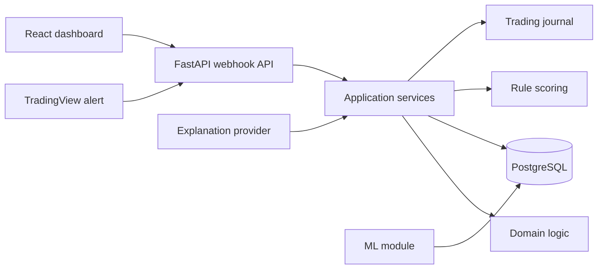

# Architektúra

Az MVP moduláris monolitként indul. A backend egy Python/FastAPI alkalmazás,
a frontend egy React/Vite SPA, az adatbázis PostgreSQL.

## Rétegek

- `domain`: SMC fogalmak, score komponensek, risk számítások.
- `application`: webhook feldolgozás, setup workflow, outcome labeling.
- `infrastructure`: SQLAlchemy repositoryk, külső adapterek.
- `api`: HTTP és webhook contract.
- `analytics`: journal és teljesítménymutatók.
- `ml`: baseline modellek és időalapú validáció.

## Fontos korlát

Az LLM magyarázhat, összefoglalhat és taníthat, de nem számolhatja a setup
pontszámot és nem lépheti át a risk policy limiteket.

