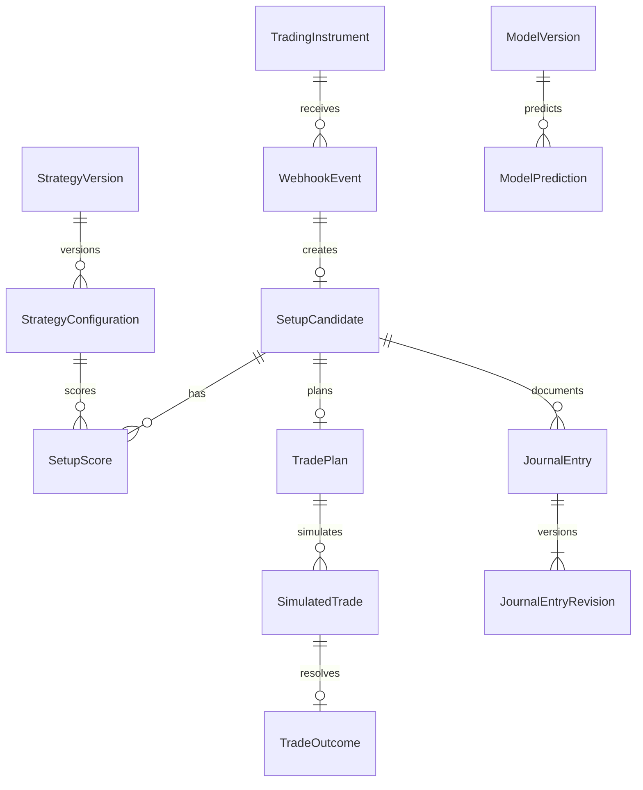

# Data model

Az adatmodell implementált táblái SQLAlchemy metadata alapján jönnek létre.
Éles telepítés előtt ezt az induláskori `create_all` folyamatot verziózott
Alembic migrációkra kell cserélni.

Az új belső üzleti entitások UUID elsődleges kulcsot és UTC időbélyeget kapnak;
a külső esemény- és setupazonosítók a forrás contract stringjei maradnak.

## Implementált táblák

### `webhook_events`

Az első tartósított entitás a beérkező TradingView webhook esemény.

| Oszlop | Típus | Megjegyzés |
| --- | --- | --- |
| `event_id` | string(200) | Elsődleges kulcs és idempotencia kulcs. |
| `event_type` | string(80) | `SETUP_CANDIDATE` vagy `MARKET_PRICE`. |
| `source` | string(80) | Jelenleg `TRADINGVIEW`. |
| `schema_version` | string(40) | Contract verzió, jelenleg `1.0`. |
| `payload` | JSON/JSONB | A validált webhook payload camelCase JSON mezőkkel. |
| `received_at` | timestamptz | A webhook befogadásának ideje. |
| `created_at` | timestamptz | A DB rekord létrehozásának ideje. |

Az `event_id` unique constraint védi az idempotenciát. Ha ugyanaz az esemény
ismét beérkezik, a repository az elsőként mentett rekordot adja vissza.

### `setup_candidates`

A pontozott, belső setup candidate rekord. Egyelőre a TradingView webhookból
származik, és az `event_id` mezőn keresztül kapcsolódik a bejövő webhook
eseményhez.

| Oszlop | Típus | Megjegyzés |
| --- | --- | --- |
| `setup_id` | string(200) | Elsődleges kulcs. Jelenleg megegyezik az `event_id` értékkel. |
| `event_id` | string(200) | Unique kulcs és kapcsolat a `webhook_events.event_id` mezőre. |
| `schema_version` | string(40) | Külső payload contract verzió. |
| `strategy_version` | string(80) | Stratégia verzió, például `smc-rce-v1`. |
| `scoring_config_version` | string(80) | Pontozási config verzió, például `rule-score-v1`. |
| `symbol` | string(40) | Instrumentum. |
| `exchange` | string(40) | Exchange vagy `UNKNOWN`. |
| `timeframe` | string(20) | TradingView timeframe. |
| `direction` | string(20) | `LONG` vagy `SHORT`. |
| `htf_bias` | string(20) | `BULLISH`, `BEARISH` vagy `NEUTRAL`. |
| `score` | float | 0-100 közötti determinisztikus setup score. |
| `accepted` | boolean | Az aktuális scoring config szerinti döntés. |
| `components` | JSON/JSONB | Komponensenkénti score snapshot. |
| `rejection_reasons` | JSON/JSONB | Hard reject okok. |
| `positive_reasons` | JSON/JSONB | Pozitív indokok. |
| `negative_reasons` | JSON/JSONB | Negatív indokok. |
| `bar_close_time` | timestamptz | A jelhez tartozó TradingView bar zárása. |
| `received_at` | timestamptz | A webhook befogadásának ideje. |
| `created_at` | timestamptz | A DB rekord létrehozásának ideje. |

Az `event_id` unique constraint miatt ugyanaz a webhook esemény nem hoz létre
több setup candidate rekordot.

### `outcome_records`

Egy offline kiértékelés megőrzött, típusosan visszaolvasható pillanatképe.

| Oszlop | Típus | Megjegyzés |
| --- | --- | --- |
| `outcome_id` | UUID | Egy eredmény elsődleges kulcsa. |
| `run_id` | UUID | A hívó által kijelölt backtest futás. |
| `event_id` | string(200) | Az értékelt TradingView esemény azonosítója. |
| `symbol` | string(40) | Instrumentum szerinti listaszűréshez. |
| `label` | string(20) | Outcome címke. |
| `evaluated_at` | timestamptz | A számítás befejezésének UTC ideje. |
| `snapshot` | JSON/JSONB | Teljes `OutcomeRecord`, tervvel, configgal és eredménnyel. |

A `(run_id, event_id)` unique constraint biztosítja az idempotenciát.
Az `event_id` és az `evaluated_at` indexelt. A lista futásra, eseményre és
szimbólumra szűrhető; sorrendje kiértékelési idő, majd UUID szerint csökkenő.

Az `event_id` itt logikai kapcsolat, nem foreign key: az offline CSV-backtest
webhook ingestion nélkül is használható. Ha az esemény már beérkezett, az
azonosító összekapcsolható a meglévő setup rekorddal. A döntést az
`ADR-0002-outcome-snapshots.md` dokumentálja.

A live paper trade eredmények ugyanebbe a táblába kerülnek a fenntartott
`00000000-0000-0000-0000-000000000007` run azonosítóval és
`paper-execution-v1` engine verzióval. Így a közös eredménymodellt használják,
de nem keverednek a backtest futásokkal.

Az új tábla a meglévő `initialize_database_schema` / `metadata.create_all`
útvonalon jön létre; a korábbi táblákat ez a változtatás nem alakítja át.
Az Alembic bevezetése továbbra is nyitott infrastruktúra-feladat. A snapshot
szerkezetének későbbi módosításakor a régi rekordok olvashatóságát migrációval
vagy verziózott readerrel meg kell őrizni.

### `backtest_runs`

A HTTP-n indított, teljesen kiértékelt batch nyilvántartása.

| Oszlop | Típus | Megjegyzés |
| --- | --- | --- |
| `run_id` | UUID | Elsődleges kulcs és kliensoldali ismétlési azonosító. |
| `completed_at` | timestamptz | Indexelt befejezési idő, a listázás rendezéséhez. |
| `snapshot` | JSON/JSONB | Típusos BacktestRun, teljes inputtal és outcome-okkal. |

Egy snapshotban megmarad a kanonikus kérés SHA-256 lenyomata, a validált
setupok, konfiguráció, eredeti CSV szöveg, kezdési/befejezési idő és a
kiértékelt outcome sorozat. A CSV-t a normál API-válaszok nem adják vissza.

A futássor és a kapcsolódó `outcome_records` sorok közös tranzakcióban
mentődnek. Egyik táblában sem marad részleges eredmény, ha az írás meghiúsul.
Későbbi részletes eredménylekérdezéshez az outcome_records használható, a
backtest részletező statisztikája pedig a futás megőrzött outcome snapshotjából
készül. Döntés: ADR-0003.

### `journal_entries`

Egy setup aktuális döntési naplója. A `setup_id` unique foreign key, ezért egy
setuphoz legfeljebb egy bejegyzés tartozik. Az opcionális `outcome_id` a
létrehozáskor kapcsolt eredményre mutat.

| Oszlop | Típus | Megjegyzés |
| --- | --- | --- |
| `journal_id` | UUID | Elsődleges kulcs. |
| `setup_id` | string(200) | Unique FK a setup candidate-re. |
| `outcome_id` | UUID/null | Opcionális FK az outcome rekordra. |
| `symbol` | string(40) | Lista- és analytics szűréshez. |
| `execution_status` | string(20) | `NOT_RECORDED`, `TAKEN` vagy `SKIPPED`. |
| `revision` | integer | Aktuális pozitív verzió. |
| `updated_at` | timestamptz | Frissítési sorrend és audit idő. |
| `snapshot` | JSON/JSONB | Teljes aktuális JournalEntry. |

### `journal_entry_revisions`

Csak hozzáfűzhető történet. A `(journal_id, revision)` összetett elsődleges
kulcs minden verziót egyszerivé tesz. A `snapshot` az adott mentés teljes
JournalEntry állapota, a `created_at` a verzió mentési ideje. Az aktuális sor és
az új revízió egy tranzakcióban készül. Döntés: ADR-0004.
