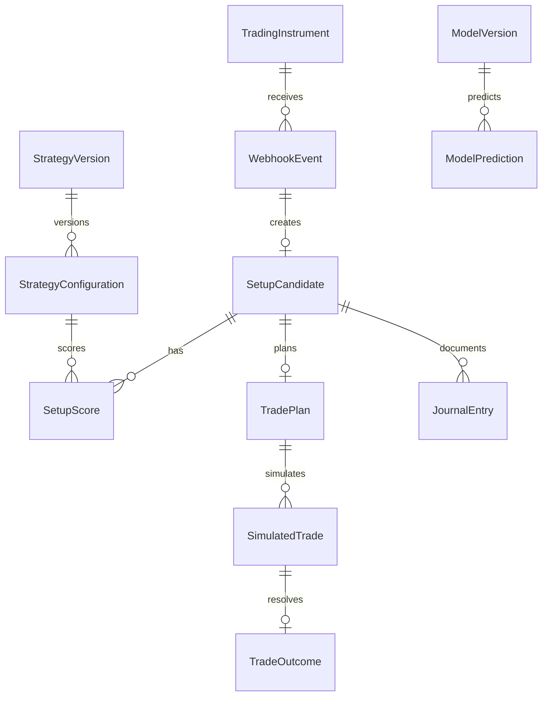

# Data model

Az első adatmodell még nem migrált adatbázis séma, hanem tervezési alap.

```mermaid
erDiagram
    TradingInstrument ||--o{ WebhookEvent : receives
    WebhookEvent ||--o| SetupCandidate : creates
    SetupCandidate ||--o{ SetupScore : has
    SetupCandidate ||--o| TradePlan : plans
    TradePlan ||--o{ SimulatedTrade : simulates
    SimulatedTrade ||--o| TradeOutcome : resolves
    SetupCandidate ||--o{ JournalEntry : documents
    StrategyVersion ||--o{ StrategyConfiguration : versions
    StrategyConfiguration ||--o{ SetupScore : scores
    ModelVersion ||--o{ ModelPrediction : predicts
```

Később minden entitás UUID elsődleges kulcsot és UTC időbélyeget kap.

