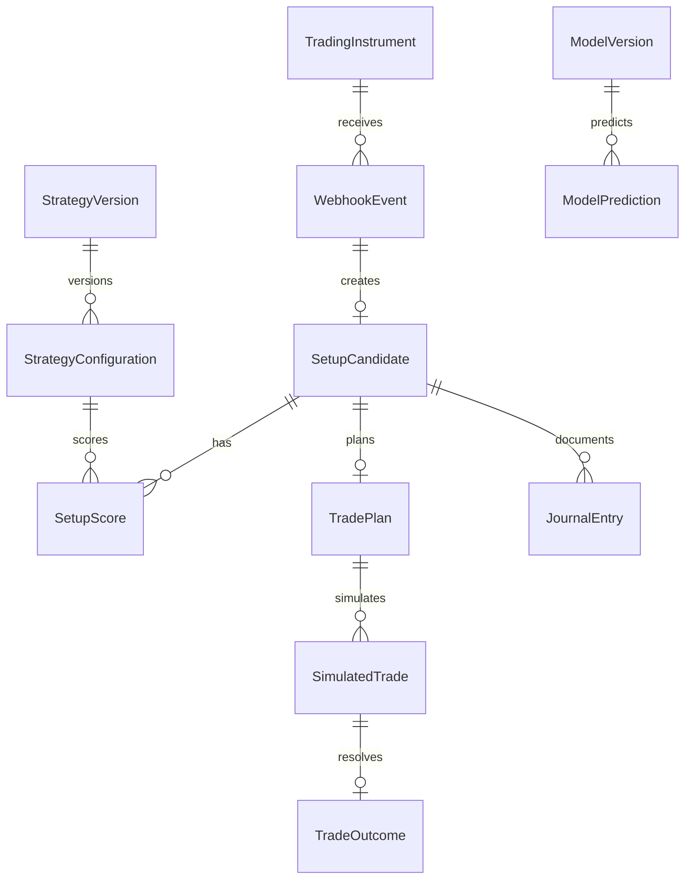

# Data model

Az első adatmodell részben már implementált adatbázis sémára épül. A
`webhook_events` tábla SQLAlchemy metadata alapján jön létre; a későbbi
fázisban ezt Alembic migrációkra kell cserélni.

Később a többi üzleti entitás UUID elsődleges kulcsot és UTC időbélyeget kap.

## Implementált táblák

### `webhook_events`

Az első tartósított entitás a beérkező TradingView webhook esemény.

| Oszlop | Típus | Megjegyzés |
| --- | --- | --- |
| `event_id` | string(200) | Elsődleges kulcs és idempotencia kulcs. |
| `event_type` | string(80) | Jelenleg `SETUP_CANDIDATE`. |
| `source` | string(80) | Jelenleg `TRADINGVIEW`. |
| `schema_version` | string(40) | Contract verzió, jelenleg `1.0`. |
| `payload` | JSON/JSONB | A validált webhook payload camelCase JSON mezőkkel. |
| `received_at` | timestamptz | A webhook befogadásának ideje. |
| `created_at` | timestamptz | A DB rekord létrehozásának ideje. |

Az `event_id` unique constraint védi az idempotenciát. Ha ugyanaz az esemény
ismét beérkezik, a repository az elsőként mentett rekordot adja vissza.
