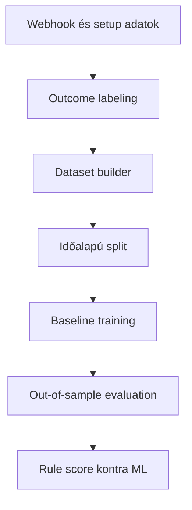

# ML pipeline

Az ML csak megbízható adatgyűjtés és outcome labeling után indul.

```mermaid
flowchart TD
    Events[Webhook és setup adatok] --> Labels[Outcome labeling]
    Labels --> Dataset[Dataset builder]
    Dataset --> Split[Időalapú split]
    Split --> Train[Baseline training]
    Train --> Eval[Out-of-sample evaluation]
    Eval --> Compare[Rule score kontra ML]
```

Véletlen train-test split idősoros adaton nem használható.

