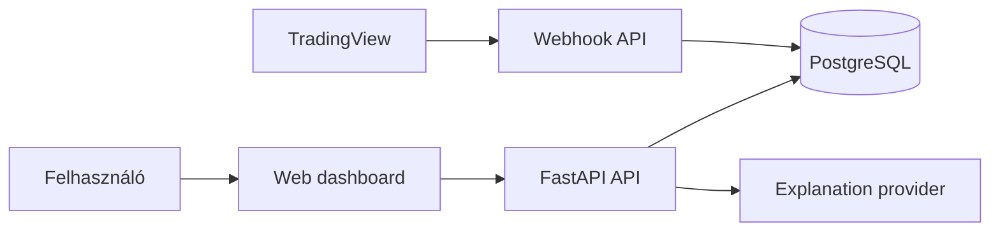

# System context

```mermaid
flowchart LR
    Trader[Felhasználó] --> Web[Web dashboard]
    TradingView[TradingView] --> Webhook[Webhook API]
    Webhook --> Database[(PostgreSQL)]
    Web --> Api[FastAPI API]
    Api --> Database
    Api --> Explanation[Explanation provider]
```

A rendszer TradingView alert payloadokat fogad, ezeket validálja, tárolja,
pontozza és journal/analytics nézeteken keresztül megjeleníti.

