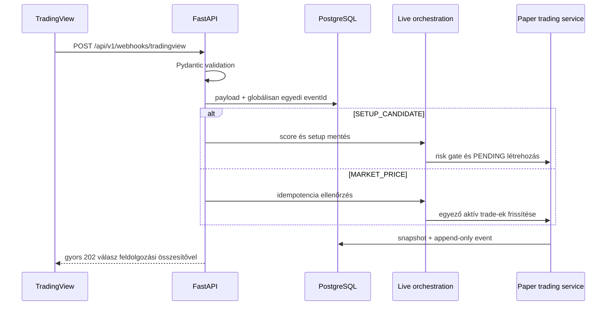

# Webhook flow

A webhook kérésben nincs ML vagy külső market-data hívás. Az aktuális szinkron
út csak lokális validációt, pontozást, risk policyt és adatbázis-műveleteket
végez. Nagy terheléshez később queue/outbox worker szükséges.
