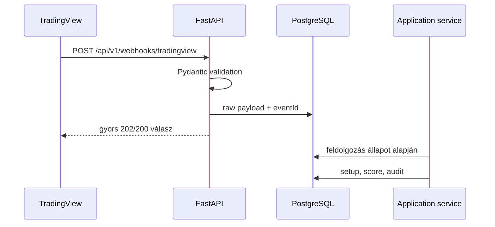

# Webhook flow

```mermaid
sequenceDiagram
    participant TV as TradingView
    participant API as FastAPI
    participant DB as PostgreSQL
    participant Worker as Application service

    TV->>API: POST /api/v1/webhooks/tradingview
    API->>API: Pydantic validation
    API->>DB: raw payload + eventId
    API-->>TV: gyors 202/200 válasz
    Worker->>DB: feldolgozás állapot alapján
    Worker->>DB: setup, score, audit
```

A webhook kérésben nem történhet hosszú ML-művelet.

