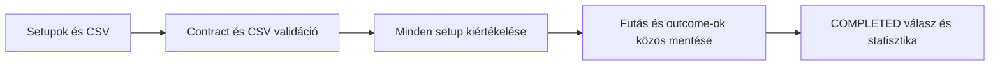

# Backtest futtatási és outcome API

## Folyamat

`POST /api/v1/backtests` egy korlátozott méretű offline batch-et futtat végig
a HTTP-kérés alatt. Egy sikeres válasz már elmentett, `COMPLETED` futást jelent.
Az endpoint a megadott setupokat értékeli; nem keres automatikusan új SMC
setupokat a CSV-ben, és nem hajt végre tőzsdei megbízást.



## Kérés

| Mező | Követelmény |
| --- | --- |
| `runId` | A kliens által választott UUID. |
| `setups` | 1-25 valid TradingView webhook payload, egyedi eventId-kkal. |
| `candlesCsv` | CSV szöveg a JSON-ban, legfeljebb 1 000 000 karakter. |
| `config` | Opcionális, az alábbi alapértékekkel. |

Egy batch egyetlen symbol/exchange/timeframe/strategyVersion kombinációt
tartalmazhat. LONG és SHORT setupok együtt is szerepelhetnek. A setupoknak
nem kell előzetesen beérkezniük a webhook endpointra. A scoring acceptance
szűrése a hívó feladata, ebben a workflowban minden beküldött setup kiértékelődik.

| Config mező | Alapérték | Határok |
| --- | --- | --- |
| `maxHoldingBars` | 30 | 1-5000 |
| `entryTimeoutBars` | 5 | 1-5000 |
| `commissionBpsPerSide` | 0 | 0-10000, véges szám |
| `slippageBpsPerSide` | 0 | 0-10000, véges szám |

A gyertyák időbélyege UTC, árai pozitív, véges számok. A CSV az eddigi
provider oszlopait használja: `time`/`timestamp`/`open_time`, OHLC, opcionális
`close_time`, volume, symbol, timeframe. A kiválasztott gyertyasor időrendben
szigorúan növekvő, duplikált nyitóidő tiltott. Duplikált fejléc, hibás
oszlopszám és hibás CSV-idézőjelezés is hibát eredményez.

A symbol és timeframe oszlop szűrhetővé teszi a CSV-t; oszlop nélkül a batch
egyetlen instrumentumához rendeljük az adatot. Az exchange-azonosságot a
forrásadat előállítójának kell biztosítania. Percalapú timeframe legfeljebb
10080 lehet; `D` és `W` esetén 1 napot és 7 napot használunk záróidő-inferáláshoz.
Havi `M` esetén explicit `close_time` oszlop szükséges.

Szerveroldali fájlútvonalat nem fogadunk el. A CSV memóriából olvasódik, majd
a futás input snapshotjában megmarad. A nyers kérés/CSV nem jelenik meg a
szokásos listázó és részletező válaszokban.

## Válaszok és ismételt kérések

- `201`: új, sikeresen befejezett és elmentett futás.
- `200`: ugyanaz a runId és ugyanaz a normalizált kérés; az eredeti futás
  tér vissza változatlan outcome-azonosítókkal és időpontokkal.
- `409`: a runId már más bemenethez vagy korábbi közvetlen outcome rekordhoz
  tartozik. Új inputhoz új runId kell.
- `422`: hibás kérés, CSV vagy hiányos kiértékelési ablak. Nem marad részleges
  futás vagy outcome rekord, az azonosító javított inputtal újra használható.

A fingerprint a validált, alapértékekkel kiegészített kérés kanonikus JSON
szerializációjának SHA-256 lenyomata. A CSV szövegének vagy a setupok
sorrendjének megváltozása is eltérő kérésnek számít. Párhuzamos ismétlésnél
legfeljebb egy új futás mentődik. A számítás még nincs háttérmunkára bontva.

A válasz tartalmazza a runId-t, `COMPLETED` státuszt, UTC kezdési/befejezési
időt, instrumentum- és stratégiaadatokat, konfigurációt, requestSha256-t,
outcomeIds listát és a korábban dokumentált nettó R-alapú statisztikát.

## Lekérdezések

| Végpont | Viselkedés |
| --- | --- |
| `GET /api/v1/backtests?limit=50` | Legutóbbi futások, 1-100 limit, count és items. |
| `GET /api/v1/backtests/{run_id}` | Egy futás és statisztikája, ismeretlen UUID-ra 404. |
| `GET /api/v1/outcomes?runId=<UUID>&symbol=<opcionális>&limit=50` | Futásra szűrt lista, kötelező runId, 1-100 limit. |
| `GET /api/v1/outcomes/{outcome_id}` | Egy részletes eredmény, ismeretlen UUID-ra 404. |
| `GET /api/v1/analytics/summary?runId=<UUID>` | A teljes futás outcome-jainak összesítése. |

Az outcome-válaszban camelCase mezők szerepelnek: azonosítók, instrumentum,
irány, entry/stop/target, evaluatedAt, engineVersion, marketDataSha256 és
`outcome` blokk. Utóbbi tartalmazza a címkét, exitReason-t, bruttó/nettó R-t,
entry/exit időket, exit árat, gyertyaszámokat, costs és excursion blokkokat.
Nem aktivált trade esetén a trade-metrikák és a két utóbbi blokk `null`.

## Kipróbálás

A repository gyökeréből, futó Docker API mellett:

```bash
curl -X POST 'http://localhost:8000/api/v1/backtests' \
  -H 'Content-Type: application/json' \
  --data-binary @examples/backtests/demo-request.json
curl 'http://localhost:8000/api/v1/backtests/c70c415f-95b7-4faa-bfca-f1a5b6a7d151'
curl 'http://localhost:8000/api/v1/outcomes?runId=c70c415f-95b7-4faa-bfca-f1a5b6a7d151'
```

A példa szintetikus gyertyákat használ, nem valós BTC árakat. Az elvárt
eredmény `WIN`, bruttó `2R`, nettó `1.937R`. Ismételt POST ugyanazt adja.
Beállításmódosításkor a fájl runId mezőjének is új UUID-t kell adni.
Interaktív dokumentáció: `http://localhost:8000/docs`, backtests/outcomes csoport.
