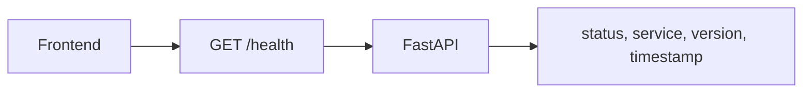

# Phase 00: Bootstrap

## 1. Mit építettünk?

Létrejött a projekt alapja: dokumentációs struktúra, aktív ExecPlan, FastAPI
backend health endpointokkal, React/Vite frontend státuszoldallal, Docker
Compose PostgreSQL-lel, `.env.example`, CI workflow, valamint az első minimális
domain számítás a risk-reward képlethez.

## 2. Miért erre van szükség?

Egy trading rendszerben a stratégia későbbi pontozása és backtestje csak akkor
lesz megbízható, ha már az elején verziózott, tesztelhető és dokumentált
alapokra építünk.

## 3. Hogyan működik a háttérben?

A backend FastAPI alkalmazásként indul. A `/health` és `/ready` végpontok
strukturált JSON választ adnak. A frontend TanStack Queryvel hívja a `/health`
végpontot, majd Ant Design komponensekkel jeleníti meg a státuszt.



## 4. Milyen alternatívák léteznek?

Lehetett volna Django, NestJS vagy Next.js full-stack alapot választani. Az MVP
számára a FastAPI és Vite egyszerűbb, gyorsabb és jól illeszkedik az
API-központú webhook feldolgozáshoz.

## 5. Miért ezt választottuk?

A FastAPI jó OpenAPI támogatást ad, Pydantic validációval dolgozik, és tisztán
szétválasztható tőle a domain logika. A React/Vite gyors fejlesztési ciklust ad
a dashboardhoz.

## 6. Kapcsolódó trading fogalmak

- Risk-reward: a tervezett nyereség és a kezdeti kockázat aránya.
- R-multiple: az eredmény az eredeti kockázathoz viszonyítva.

## 7. Gyakori hibák vagy félreértések

- A health endpoint nem bizonyítja, hogy az adatbázis és a teljes pipeline kész.
- A jó risk-reward arány önmagában nem jelent pozitív expectancyt.
- A bootstrap nem trading edge, csak mérhető fejlesztési alap.

## 8. Olvasandó fájlok

- `AGENTS.md`
- `ARCHITECTURE.md`
- `apps/api/src/smc_assistant/main.py`
- `apps/api/src/smc_assistant/domain/risk.py`
- `apps/web/src/App.tsx`
- `docs/exec-plans/active/full-project.md`

## 9. Manuális kipróbálás

```bash
cp .env.example .env
docker compose up --build
```

Majd nyisd meg:

- `http://localhost:8000/health`
- `http://localhost:5173`

## 10. Gyakorlófeladat

Módosítsd a frontend státuszoldalon megjelenő timestamp formátumot úgy, hogy
külön jelenjen meg a dátum és az idő. Figyeld meg, hogy a backend UTC időt ad,
a böngésző pedig helyi időzónában jeleníti meg.

