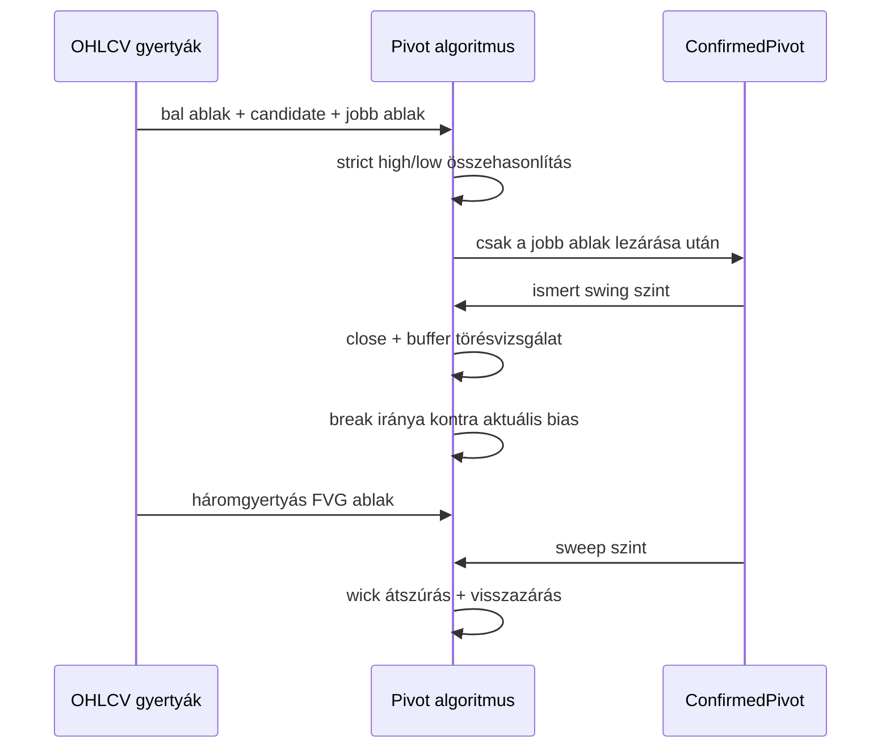

# Phase 01: Domain modell alapok

## 1. Mit építettünk?

Elkészült az első OHLCV `Candle` domain modell, valamint a confirmed swing high
és swing low pivot algoritmus. Erre ráépült az első BOS detektor is, amely
ismert swing high vagy swing low szint záróáras, bufferrel szűrt áttörését
jelöli. Elkészült az első CHoCH klasszifikáció is, amely a BOS eseményeket az
aktuális `MarketBias` állapothoz viszonyítja. Elkészült az első háromgyertyás
Fair Value Gap modell is. Elkészült az első liquidity sweep detektor confirmed
pivotokra, wick átszúrásra és visszazárásra építve.

A `Candle` modell validálja az UTC időbélyegeket, az OHLC árkapcsolatokat és az
opcionális volumen értékét.

## 2. Miért erre van szükség?

A BOS, CHoCH, liquidity sweep és FVG logika mind gyertyákból és megerősített
struktúrapontokból épül. Ha a swing pontok felismerése és törése nem
determinisztikus, akkor a későbbi setup score és backtest sem lesz megbízható.

## 3. Hogyan működik a háttérben?

A pivot algoritmus egy jelölt gyertyát összevet a bal és jobb oldali ablakkal.
Swing high csak akkor jön létre, ha a jelölt high értéke szigorúan nagyobb az
összes környező high értéknél. Swing low esetén a jelölt low értéke szigorúan
kisebb az összes környező low értéknél.

A BOS detektor csak olyan pivotot törhet, amely a break gyertya előtt már
ismert volt. Alapértelmezésben a törést a záróárnak kell megerősítenie.

A CHoCH réteg időrendben végigmegy a structure break eseményeken. Ha az induló
bias `NEUTRAL`, az első törés csak beállítja az irányt. Ha később ellentétes
irányú törés érkezik, akkor `BULLISH_CHOCH` vagy `BEARISH_CHOCH` esemény jön
létre.

Az FVG detektor három gyertyás ablakokat vizsgál. Bullish FVG akkor jön létre,
ha az első gyertya high értéke alacsonyabb, mint a harmadik gyertya low értéke.
Bearish FVG akkor jön létre, ha az első gyertya low értéke magasabb, mint a
harmadik gyertya high értéke.

A liquidity sweep detektor confirmed swing szinteket használ. Bullish sweep
akkor jön létre, ha az ár egy ismert swing low alá szúr, majd visszazár fölé.
Bearish sweep akkor jön létre, ha az ár egy ismert swing high fölé szúr, majd
visszazár alá.



## 4. Milyen alternatívák léteznek?

- Lazább pivot modell, amely egyenlő high/low esetén is jelöl.
- Fraktál alapú modell azonos bal/jobb ablakkal.
- ATR vagy volatilitás alapján szűrt swing modell.
- ZigZag-szerű százalékos elmozdulás modell.
- Wick alapú BOS close confirmation nélkül.
- Trendállapotot is kezelő BOS/CHoCH state machine.
- Több idősíkú bias modell, ahol a CHoCH csak HTF kontextusban érvényes.
- Bonyolultabb FVG modell ATR-szűréssel, mitigation állapottal és életkorral.
- Sweep modell displacement vagy CHoCH kötelező megerősítéssel.
- Sweep modell több gyertyás likviditási zónákkal, nem csak pivot szinttel.

## 5. Miért ezt választottuk?

Az induló szigorú pivot, záróáras BOS, bias-alapú CHoCH és háromgyertyás FVG
modell, valamint az egyszerű sweep modell reprodukálható és jól tesztelhető.
Tanulási célra is jó, mert világosan látszik, mikor válik ismertté egy swing,
mikor történik struktúratörés, mikor vált a struktúra karaktert, mikor alakul ki
imbalance, és mikor történik likviditási szint átszúrása.

## 6. Milyen trading fogalmak kapcsolódnak hozzá?

- Swing high: megerősített lokális csúcs.
- Swing low: megerősített lokális mélypont.
- BOS: ismert swing szint áttörése, alapértelmezésben záróárral megerősítve.
- CHoCH: az aktuális bias-szal ellentétes irányú structure break.
- FVG: háromgyertyás imbalance, ahol az első és harmadik gyertya között üres
  árzóna marad.
- Liquidity sweep: ismert swing szint kanócos átszúrása és visszazárás a szint
  mögé.
- Future leakage: jövőbeli információ használata a döntési pillanat előtt.
- Repainting: amikor egy indikátor utólag úgy rajzol jelet, mintha az korábban
  is ismert lett volna.

## 7. Milyen hibák vagy félreértések fordulhatnak elő?

- A pivotgyertya nem azonos a pivot felismerési idejével.
- A túl kis `rightBars` zajos jeleket adhat.
- A túl nagy `rightBars` késői, de stabilabb jeleket adhat.
- Az egyenlő high/low értékeket az első verzió nem jelöli pivotként.
- A wick-only törés alapértelmezésben nem BOS, mert `close_confirmation = true`.
- A CHoCH nem jelent automatikus trendfordulót vagy belépési jelzést.
- A túl gyors bias váltás zajos piacon sok hamis CHoCH jelzést adhat.
- Az FVG csak a harmadik gyertya lezárása után ismert.
- Az érintkező gyertyák nem alkotnak FVG-t, mert nincs mérhető gap.
- A sweep csak akkor érvényes, ha a pivot már a sweep gyertya előtt ismert volt.
- A sweep nem azonos BOS-szal: sweepnél wick átszúrás és visszazárás kell,
  BOS-nál alapértelmezésben záróáras szinttörés.

## 8. Mely fájlokat érdemes elolvasni?

- `apps/api/src/smc_assistant/domain/candles.py`
- `apps/api/src/smc_assistant/domain/market_structure.py`
- `apps/api/src/smc_assistant/domain/fair_value_gaps.py`
- `apps/api/src/smc_assistant/domain/liquidity.py`
- `apps/api/tests/test_candles.py`
- `apps/api/tests/test_market_structure.py`
- `apps/api/tests/test_fair_value_gaps.py`
- `apps/api/tests/test_liquidity.py`
- `docs/strategy/market-structure.md`
- `docs/strategy/fair-value-gaps.md`
- `docs/strategy/liquidity.md`

## 9. Hogyan lehet manuálisan kipróbálni?

```bash
cd apps/api
/Users/bencevarga/Library/Python/3.10/bin/uv run pytest tests/test_market_structure.py
/Users/bencevarga/Library/Python/3.10/bin/uv run pytest tests/test_fair_value_gaps.py
/Users/bencevarga/Library/Python/3.10/bin/uv run pytest tests/test_liquidity.py
```

## 10. Gyakorlófeladat

Változtasd meg az egyik liquidity sweep tesztben a `max_confirmation_bars`
értékét 0-ról 1-re. Figyeld meg, hogyan válik elfogadhatóvá a következő
gyertyán történő visszazárás.
