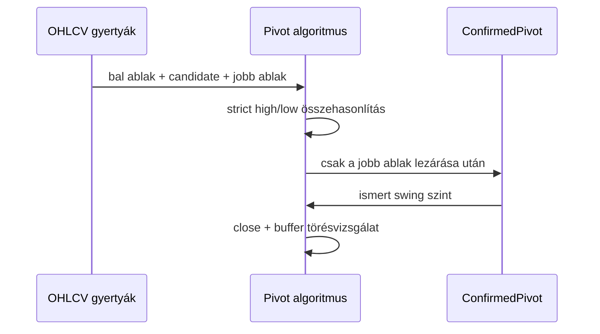

# Phase 01: Domain modell alapok

## 1. Mit építettünk?

Elkészült az első OHLCV `Candle` domain modell, valamint a confirmed swing high
és swing low pivot algoritmus. Erre ráépült az első BOS detektor is, amely
ismert swing high vagy swing low szint záróáras, bufferrel szűrt áttörését
jelöli.

A `Candle` modell validálja az UTC időbélyegeket, az OHLC árkapcsolatokat és az
opcionális volumen értékét.

## 2. Miért erre van szükség?

A BOS, CHoCH, liquidity sweep és FVG logika mind gyertyákból és megerősített
struktúrapontokból épül. Ha a swing pontok felismerése és törése nem
determinisztikus, akkor a későbbi setup score és backtest sem lesz megbízható.

## 3. Hogyan működik a háttérben?

A pivot algoritmus egy jelölt gyertyát összevet a bal és jobb oldali ablakkal.
Swing high csak akkor jön létre, ha a jelölt high értéke szigorúan nagyobb az
összes környező high értéknél. Swing low esetén a jelölt low értéke szigorúan
kisebb az összes környező low értéknél.

A BOS detektor csak olyan pivotot törhet, amely a break gyertya előtt már
ismert volt. Alapértelmezésben a törést a záróárnak kell megerősítenie.



## 4. Milyen alternatívák léteznek?

- Lazább pivot modell, amely egyenlő high/low esetén is jelöl.
- Fraktál alapú modell azonos bal/jobb ablakkal.
- ATR vagy volatilitás alapján szűrt swing modell.
- ZigZag-szerű százalékos elmozdulás modell.
- Wick alapú BOS close confirmation nélkül.
- Trendállapotot is kezelő BOS/CHoCH state machine.

## 5. Miért ezt választottuk?

Az induló szigorú pivot és záróáras BOS modell egyszerű, reprodukálható és jól
tesztelhető. Tanulási célra is jó, mert világosan látszik, mikor válik ismertté
egy swing, és mikor történik tényleges struktúratörés.

## 6. Milyen trading fogalmak kapcsolódnak hozzá?

- Swing high: megerősített lokális csúcs.
- Swing low: megerősített lokális mélypont.
- BOS: ismert swing szint áttörése, alapértelmezésben záróárral megerősítve.
- Future leakage: jövőbeli információ használata a döntési pillanat előtt.
- Repainting: amikor egy indikátor utólag úgy rajzol jelet, mintha az korábban
  is ismert lett volna.

## 7. Milyen hibák vagy félreértések fordulhatnak elő?

- A pivotgyertya nem azonos a pivot felismerési idejével.
- A túl kis `rightBars` zajos jeleket adhat.
- A túl nagy `rightBars` késői, de stabilabb jeleket adhat.
- Az egyenlő high/low értékeket az első verzió nem jelöli pivotként.
- A wick-only törés alapértelmezésben nem BOS, mert `close_confirmation = true`.
- Ez a BOS réteg még nem dönti el, hogy az esemény trendfolytatás vagy CHoCH.

## 8. Mely fájlokat érdemes elolvasni?

- `apps/api/src/smc_assistant/domain/candles.py`
- `apps/api/src/smc_assistant/domain/market_structure.py`
- `apps/api/tests/test_candles.py`
- `apps/api/tests/test_market_structure.py`
- `docs/strategy/market-structure.md`

## 9. Hogyan lehet manuálisan kipróbálni?

```bash
cd apps/api
/Users/bencevarga/Library/Python/3.10/bin/uv run pytest tests/test_market_structure.py
```

## 10. Gyakorlófeladat

Változtasd meg egy BOS tesztben a `break_buffer` értékét 0-ról 1-re, majd
figyeld meg, mikor marad el a BOS esemény. Ez segít megérteni, miért szűrjük a
minimális szinttúllépést.
