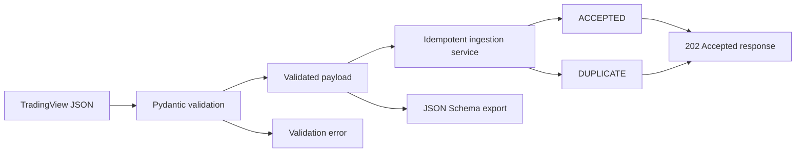

# Phase 02: Webhook contract és endpoint

## 1. Mit építettünk?

Elkészült a TradingView webhook első verziózott Pydantic contractja. A modell
validálja a `schemaVersion`, `eventId`, `eventType`, `source`, timeframe,
bar-időbélyeg, market structure, FVG, execution és feature mezőket.

Emellett létrejött az első HTTP fogadó endpoint:
`POST /api/v1/webhooks/tradingview`. Valid payload esetén az API `202 Accepted`
választ ad, de még nem ment adatbázisba és még nem indít setup scoringot.

Az endpoint mögött már van egy első idempotens ingestion service is. Ez
`eventId` alapján kezeli az ismételt webhook beküldéseket: az első beküldés
`ACCEPTED`, a későbbi azonos `eventId` beküldés `DUPLICATE`.

Most már van első SQLAlchemy/PostgreSQL persistence réteg is. Docker Compose
alatt a backend PostgreSQL repositoryval indul, közvetlen lokális fejlesztésnél
pedig alapból memory repository marad, hogy gyorsan lehessen tesztelni.

A webhook flow audit eseményeket is ír. Sikeres befogadáskor
`WEBHOOK_ACCEPTED`, duplikált `eventId` esetén `WEBHOOK_DUPLICATE`, hibás
payload validációnál `WEBHOOK_VALIDATION_FAILED` keletkezik.

## 2. Miért erre van szükség?

A TradingView alert egy külső rendszerből érkezik. A backend csak akkor tud
auditálhatóan és biztonságosan dolgozni vele, ha a payload formája explicit,
tesztelt és verziózott.

## 3. Hogyan működik a háttérben?

A contract camelCase JSON mezőket fogad, például `schemaVersion`,
`barOpenTime`, `marketStructure`. Pythonban ezek snake_case attribútumokká
válnak, például `schema_version`, `bar_open_time`, `market_structure`.



## 4. Milyen alternatívák léteznek?

- Laza `dict` alapú payload kezelés.
- JSON Schema kézi írása Pydantic modell nélkül.
- Külön OpenAPI-first contract generálás.

## 5. Miért ezt választottuk?

A Pydantic modell közvetlenül illeszkedik a FastAPI-hoz, runtime validációt ad,
és JSON Schema is generálható belőle. Így egyetlen forrásból kapunk validációt
és dokumentálható contractot.

## 6. Milyen trading fogalmak kapcsolódnak hozzá?

- Setup candidate: még nem trade, hanem elemzésre beküldött setup jelölt.
- HTF bias: magasabb idősíkú irányultság.
- FVG: a setuphoz tartozó Fair Value Gap zóna.
- Risk-reward: az entry, stop loss és take profit távolságából számolt arány.

## 7. Milyen hibák vagy félreértések fordulhatnak elő?

- A webhook payload nem tartalmazhat API-kulcsot vagy jelszót.
- A `riskReward` mező nem önálló igazság: egyeznie kell az entry/stop/target
  képlettel.
- A `eventId` még nem adatbázisos deduplikáció, de már kötelező contract mező.
- Extra mezőket most tiltunk, hogy ne csússzon be dokumentálatlan adat.
- A hibás payload API válasza nem echozza vissza a nyers input értékeket. Ez
  csökkenti annak esélyét, hogy véletlenül beküldött secret visszakerüljön a
  kliensoldali vagy proxy logokba.
- Az idempotencia jelenleg in-memory repositoryval működik, tehát folyamat
  újraindítás után nem marad meg. Docker Compose alatt viszont már PostgreSQL
  repository használható.
- A táblaséma most `metadata.create_all()` segítségével inicializálódik. Ez jó
  első fejlesztési lépés, de később Alembic migrációkra kell váltani.
- Az audit metadata nem tartalmaz nyers webhook payloadot. Hibás payloadnál csak
  HTTP metódus, útvonal, hibaszám és validációs hibatípusok kerülnek az audit
  eseménybe.

## 8. Mely fájlokat érdemes elolvasni?

- `apps/api/src/smc_assistant/contracts/tradingview.py`
- `apps/api/src/smc_assistant/application/audit.py`
- `apps/api/src/smc_assistant/api/webhooks.py`
- `apps/api/src/smc_assistant/api/errors.py`
- `apps/api/src/smc_assistant/application/webhook_ingestion.py`
- `apps/api/src/smc_assistant/infrastructure/in_memory_webhook_events.py`
- `apps/api/src/smc_assistant/infrastructure/sql_webhook_events.py`
- `apps/api/src/smc_assistant/infrastructure/webhook_event_schema.py`
- `apps/api/src/smc_assistant/infrastructure/webhook_ingestion_factory.py`
- `apps/api/src/smc_assistant/infrastructure/logging_audit.py`
- `apps/api/tests/contracts/test_tradingview_contract.py`
- `apps/api/tests/test_tradingview_webhook_api.py`
- `apps/api/tests/test_webhook_ingestion.py`
- `apps/api/tests/test_sql_webhook_events.py`
- `docs/contracts/tradingview-webhook.md`
- `docs/contracts/generated/tradingview-webhook.schema.json`
- `scripts/export_tradingview_schema.py`

## 9. Hogyan lehet manuálisan kipróbálni?

```bash
cd apps/api
/Users/bencevarga/Library/Python/3.10/bin/uv run pytest tests/contracts/test_tradingview_contract.py
/Users/bencevarga/Library/Python/3.10/bin/uv run pytest tests/test_tradingview_webhook_api.py
/Users/bencevarga/Library/Python/3.10/bin/uv run pytest tests/test_webhook_ingestion.py
/Users/bencevarga/Library/Python/3.10/bin/uv run pytest tests/test_sql_webhook_events.py
/Users/bencevarga/Library/Python/3.10/bin/uv run python ../../scripts/export_tradingview_schema.py
```

## 10. Gyakorlófeladat

Változtasd meg a teszt payloadban a `riskReward` értéket 3.0-ról 2.0-ra, és
figyeld meg, hogy a validáció elutasítja a payloadot.
