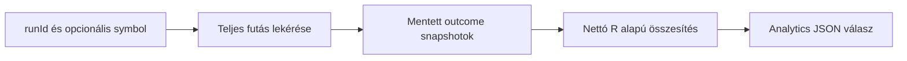

# Phase 05: Outcome és backtest

## 1. Mit építettünk?

Elkészült az első outcome domain modul:
`apps/api/src/smc_assistant/domain/outcomes.py`.

Az első szelet egy conservative triple-barrier engine:

- validált `TradePlan`;
- `OutcomeConfig` maximális tartási és entry timeout gyertyaszámmal;
- `TradeOutcome` auditálható kimeneti mezőkkel;
- `evaluate_triple_barrier_outcome` függvény.

Elkészült az első market data input réteg is:

- `MarketDataQuery`;
- `MarketDataProvider` protocol;
- `CsvMarketDataProvider`;
- timeframe alapú `close_time` inferálás.

Elkészült az első outcome evaluation application réteg:

- TradingView payload `execution` blokkból `TradePlan` építés;
- market data lekérés symbol, timeframe és a setup gyertya záróideje alapján;
- triple-barrier outcome futtatás importált gyertyákon.

Elkészült az első commission/slippage modell:

- bps-alapú oldalankénti commission;
- bps-alapú oldalankénti slippage;
- bruttó `realized_r`;
- nettó `net_realized_r`;
- részletes `TradeCostEstimate`.

Elkészült az első MFE/MAE számítás:

- `TradeExcursion` modell;
- maximum favorable excursion R-ben;
- maximum adverse excursion R-ben;
- irányhelyes long/short ármezők;
- `NOT_TRIGGERED` esetben üres excursion.

## 2. Fontos döntések

- Az engine csak lezárt, jövőbeli OHLCV gyertyákból dolgozik.
- A gyertyákat időrendben várja, és rendezetlen inputra hibát dob.
- Az entry akkor aktiválódik, ha a gyertya high/low tartománya érinti az entry
  árat.
- Ha az entry nem aktiválódik az entry timeout ablakban, az outcome
  `NOT_TRIGGERED`.
- Ha ugyanazon gyertyán belül a stop és a target is érinthető, konzervatívan a
  stop számít előbbinek.
- Vertikális barrier esetén az exit ár az utolsó vizsgált gyertya záróára.
- A `realized_r` ugyanarra az R-alapú logikára épül, mint a korábbi risk modul.
- A CSV provider csak UTC időbélyegeket fogad el, hogy a backtest ne keverjen
  lokális és tőzsdei időzónákat.
- A provider csak időrendben rendezett gyertyákat fogad el.
- Az első outcome evaluation a setup `barCloseTime` értékétől induló market
  data szeletet kér, hogy ne használjon a setup gyertya előtti adatot.
- A commission és slippage első verziója egyszerű round-trip becslés, amely az
  entry és exit notional összegére alkalmazott bps költséget R-re vetíti.
- A bruttó R mező megmarad, hogy később tisztán össze lehessen hasonlítani a
  költségek előtti és utáni backtest eredményeket.
- Az MFE/MAE számítás az entry aktiválódása utáni, exitig vizsgált gyertyákból
  dolgozik. Így megmutatja, mennyit adott a piac a setup irányába és mennyire
  ment ellene még akkor is, ha a végső outcome csak `WIN`, `LOSS` vagy
  `TIMEOUT`.

## 3. Ellenőrzés

- Célzott outcome teszt: `uv run pytest tests/test_outcomes.py`.
- Célzott CSV market data teszt: `uv run pytest tests/test_csv_market_data.py`.
- Célzott outcome evaluation teszt:
  `uv run pytest tests/test_outcome_evaluation.py`.
- Célzott commission/slippage ellenőrzés az outcome és outcome evaluation
  tesztekben.
- Célzott MFE/MAE ellenőrzés az outcome tesztekben.
- Teljes backend regresszió: `uv run pytest`.
- Statikus ellenőrzés: `uv run ruff check .`, `uv run mypy src`.

## 4. Következő lépés

Backtest futtatási folyamat és outcome lekérdező API kialakítása, hogy a
kiértékelés és a mentett futások kiválasztása HTTP-n keresztül is elérhető
legyen. Ezt követi a dashboard megjelenítés.

## 5. Outcome persistence

Az `application/outcome_records.py` köti össze a számítást és a mentést.
A `run_id` egy kiértékelési futás UUID azonosítója; az `outcome_id` egyetlen
eredményé. Ugyanaz a futás és esemény mindig az első rekordot adja vissza.
Ez az idempotencia: egy megismételt kérés nem szaporítja a statisztikai mintát.
Új konfigurációt új futásazonosítóval értékelünk.

A repository egy tárolási interfész. A memóriában tároló adapter gyors
tesztduplum, az SQL adapter PostgreSQL-en tartósan megőrzi ugyanazt a rekordot.
A `snapshot` a terv, config, outcome, költség, MFE/MAE és verziók együttese.
A Pydantic `TypeAdapter` visszaolvasáskor a JSON időbélyegekből és enum
szövegekből ismét típusos Python objektumokat épít.

A mentés előtt ellenőrizzük, hogy a rendelkezésre álló gyertyák elégségesek-e
a végleges címkéhez. Egyetlen még nyitott megfigyelési ablakból nem mentünk
végleges `TIMEOUT` eredményt. A stop/target elérése korábban is lezárhatja az
értékelést. A `NOT_TRIGGERED` eredményhez teljes entry ablak szükséges.

A SHA-256 az adatsor lenyomata: eltérő gyertya eltérő lenyomatot ad. Ez segít
ellenőrizni, hogy ugyanazt az inputot használtuk-e, de az adatot nem lehet
visszaállítani belőle. A forrás CSV-t külön meg kell őrizni.

Fontos korlát: az MFE/MAE egész OHLC gyertyák szélsőértékeiből készül,
beleértve az entry és exit gyertyát. Ebből a gyertyán belüli, tényleges
pozíciótartási időszak szélsőértékei nem különíthetők el biztosan.

### Olvasási sorrend

1. `apps/api/src/smc_assistant/application/outcome_records.py`
2. `apps/api/src/smc_assistant/infrastructure/in_memory_outcomes.py`
3. `apps/api/src/smc_assistant/infrastructure/sql_outcomes.py`
4. `apps/api/tests/test_outcome_records.py`
5. `docs/decisions/ADR-0002-outcome-snapshots.md`

### Kipróbálás

Az `apps/api` könyvtárban:

```bash
uv run pytest tests/test_outcome_records.py -v
```

Ez memóriában és SQLite-on ellenőrzi a visszaolvasást, ismételt mentést,
külön futásokat, szűrést, hiányos adatot és adatbázis-újranyitást. Valódi
PostgreSQL teszthez a futó lokális adatbázist a projekt Settings beállításából
olvashatjuk ki, anélkül hogy a kapcsolati adatot a kimenetre írnánk:

```bash
uv run python -c 'import os, subprocess, sys; from smc_assistant.config import Settings; env = dict(os.environ, TEST_POSTGRES_URL=Settings().database_url); sys.exit(subprocess.run([sys.executable, "-m", "pytest", "tests/test_outcome_records.py", "-k", "postgres", "-v"], env=env).returncode)'
```

A PostgreSQL tesztek saját, véletlen nevű sémát hoznak létre, majd eltakarítják
azt. A dashboard és a korábbi webhook rekordok megmaradnak.

Alkalmazáskódban egy validált `payload` és egy `CsvMarketDataProvider` esetén:

```python
from uuid import uuid4

from smc_assistant.application.outcome_records import evaluate_and_save_tradingview_outcome
from smc_assistant.config import Settings
from smc_assistant.infrastructure.database import (
    create_database_engine,
    initialize_database_schema,
)
from smc_assistant.infrastructure.sql_outcomes import SQLOutcomeRepository

engine = create_database_engine(Settings().database_url)
try:
    initialize_database_schema(engine)
    repository = SQLOutcomeRepository(engine)
    run_id = uuid4()
    result = evaluate_and_save_tradingview_outcome(
        payload, provider, repository, run_id=run_id
    )
    restored = repository.get_by_outcome_id(result.record.outcome_id)
finally:
    engine.dispose()
```

### Gyakorlófeladat

Nézd meg a `test_new_run_keeps_both_configurations` tesztet: azonos setup
költségekkel `1.937R`, költségek nélkül `2R`. Miért kell új `run_id` a második
értékeléshez, és mi történne az első futás azonosítójának újrafelhasználásakor?

## 6. Backtest analytics

Elkészült a tiszta `analytics/backtest.py` összesítő, a repositoryból teljes
futást olvasó application függvény és a `GET /api/v1/analytics/summary` API.
A HTTP mezőket és a pontos számítási szabályokat a
`docs/contracts/backtest-analytics.md` dokumentálja.



### Miért ezek a mutatók?

A win rate megmutatja a pozitív nettó eredménnyel lezárt trade-ek arányát.
Az expectancy a mintában megfigyelt átlagos nettó R trade-enként. A profit
factor a pozitív R-ek összegét osztja a negatív R-ek abszolút összegével.
Ezek külön szempontok: a találati arány önmagában nem írja le az eredményt.

Példa: `+2R, -1R, +0.5R, -0.5R, 0R`. Öt trade-ből kettő nyerő, ezért a
nettó win rate `40%`; összesen `+1R`, az expectancy `0.2R`, a profit factor
`2.5 / 1.5 = 1.666667`. Három további nem aktiválódott setup esetén is
ugyanezek a trade-mutatók maradnak, csak a setup darabszám emelkedik nyolcra.

A `WIN` outcome címke a barrier alapján születik. Ha a költségek elviszik a
nyereséget, a trade az analyticsben nettó vesztes lehet. Emiatt külön
mutatjuk az eredeti címkék és a nettó eredményelőjelek darabszámát.

### Technikai döntések

A statisztika kötelező futásazonosítóhoz tartozik. A repository külön
`list_for_run` metódust kapott, amely a teljes kiválasztást adja vissza.
A `list_recent` 50-es alaplimitjét statisztikához használni csendesen
kihagyná a régebbi eredményeket. Ezt 106 rekorddal külön teszteljük.

Az első változat Pythonban számol, ugyanazzal a logikával minden adatbázison.
Alternatíva az SQL aggregáció, ami nagy adatmennyiségnél hatékonyabb lehet.
Jelenleg az egész kiválasztás memóriába töltődik, ezért nagy futásoknál később
streaming vagy SQL összesítés indokolt. A `math.fsum` csökkenti a lebegőpontos
összegzés hibáját; csak a kész mutatókat kerekítjük.

A profit factor veszteség nélkül `null`, nem nulla és nem végtelen. A nulla
érték azt jelentené, hogy volt veszteség, de nem volt nyereség. Lezárt trade
nélkül a win rate és expectancy sem értelmezhető, ezért azok is `null`-ok.

### Korlátok és folytatás

Az API az eddig mentett eredményeket összesíti; nem állítja, hogy a futás
minden tervezett setupját már kiértékeltük. Külön futásnyilvántartás még nincs.
Egy futás egységes konfigurációja továbbra is a hívó felelőssége. A win rate
0-1 skálán érkezik, százalékként a felületnek kell formáznia.

Egyelőre nincs equity curve, drawdown vagy session szerinti bontás. A
frontend még nem jeleníti meg az új API adatait.

### Olvasás és gyakorlás

Olvasási sorrend: `analytics/backtest.py`, `application/backtest_analytics.py`,
`api/analytics.py`, majd `tests/test_backtest_analytics.py`.

Az `apps/api` könyvtárban:

```bash
uv run pytest tests/test_backtest_analytics.py tests/test_analytics_api.py
```

Gyakorlófeladat: a fenti öt trade mellé adj egy `-0.1R` nettó eredményű,
eredetileg `WIN` címkéjű trade-et. Hogyan változik a nettó win rate és az
expectancy? Miért nem elég megszámolni a `WIN` címkéket?
