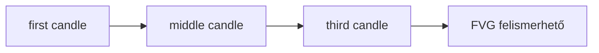

# Fair Value Gaps

Az induló FVG modell háromgyertyás:

- Bullish FVG: az első gyertya high értéke kisebb a harmadik gyertya low
  értékénél.
- Bearish FVG: az első gyertya low értéke nagyobb a harmadik gyertya high
  értékénél.

## Konfiguráció

- minimális abszolút méret;
- minimális tickméret;
- ATR-hez viszonyított minimális méret;
- belépési százalék;
- teljes vagy részleges mitigation;
- maximális életkor;
- első visszateszt követelménye.

## Első algoritmikus definíció

Az első implementáció három egymást követő gyertyát vizsgál:

```text
first = candles[i - 2]
middle = candles[i - 1]
third = candles[i]
```

Bullish FVG:

```text
first.high < third.low
lower = first.high
upper = third.low
```

Bearish FVG:

```text
first.low > third.high
lower = third.high
upper = first.low
```

A gap felismerési ideje `detected_at_index = third_candle_index`, mert a
háromgyertyás minta csak a harmadik gyertya lezárása után ismert.



## Méretszűrés

Az induló `FairValueGapSettings` két egyszerű szűrőt támogat:

- `min_absolute_size`: a gap minimális abszolút árkülönbsége.
- `tick_size` + `min_size_ticks`: minimális méret tickben kifejezve.

Az ATR-hez viszonyított méret, mitigation, életkor és első visszateszt
követelménye későbbi mérföldkőben kerül be, amikor már a setup scoring és a
backtest is használni tudja.

## Edge case-ek

- Ha `first.high == third.low`, nincs bullish FVG, mert nincs valódi üres zóna.
- Ha `first.low == third.high`, nincs bearish FVG.
- Háromnál kevesebb gyertyából nem lehet FVG-t felismerni.
- Átfedő háromgyertyás ablakokat is vizsgálunk, mert egymás után több FVG is
  kialakulhat.

## Kapcsolódó kód

- `apps/api/src/smc_assistant/domain/fair_value_gaps.py`
- `apps/api/tests/test_fair_value_gaps.py`
