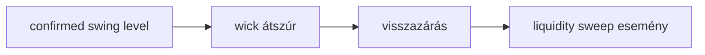

# Liquidity

Liquidity sweep akkor jelölhető, ha az ár kanóccal átlép egy korábbi
megerősített swing szintet, majd visszazár a szint mögé.

## Első algoritmikus definíció

A sweep kizárólag confirmed pivotokra épül. Egy pivot csak akkor vehető
figyelembe, ha a sweep gyertya előtt már ismert volt:

```text
pivot.confirmedAtIndex < sweepCandleIndex
```

Bullish sweep, vagy sell-side liquidity sweep:

```text
pivot.kind = SWING_LOW
candle.low < pivot.price - sweepBuffer
confirmation.close > pivot.price
```

Bearish sweep, vagy buy-side liquidity sweep:

```text
pivot.kind = SWING_HIGH
candle.high > pivot.price + sweepBuffer
confirmation.close < pivot.price
```

Alapértelmezésben `maxConfirmationBars = 0`, vagyis az átszúró gyertyának
ugyanazon a gyertyán kell visszazárnia a szint mögé. Ha ez nagyobb nullánál,
akkor a visszazárás későbbi gyertyán is történhet a megadott ablakon belül.



Egy pivothoz csak egy sweep esemény készül. Ez megakadályozza, hogy ugyanazon
régi likviditási szint ismételt átszúrásai túl sok duplikált setup kontextust
hozzanak létre.

## Edge case-ek

- A sweep ugyanazon gyertyán zár vissza.
- A sweep csak későbbi gyertyán kap megerősítést.
- A sweep után nincs displacement vagy CHoCH.
- Túl régi swing szint hamis relevanciát adhat.
- Ha a kanóc csak érinti a szintet, de nem lépi át, nincs sweep.
- Ha a visszazárás a konfigurált megerősítési ablak után történik, nincs sweep.
- A sweep önmagában nem belépési jel, csak likviditási esemény.

## Kapcsolódó kód

- `apps/api/src/smc_assistant/domain/liquidity.py`
- `apps/api/tests/test_liquidity.py`
