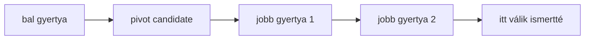

# Market structure

A market structure a swing high és swing low sorozatokból épül. A rendszer csak
megerősített pivotokat használ, így nem úgy kezeli a történelmi adatot, mintha
a pivot már a pivotgyertya pillanatában ismert lett volna.

## Induló paraméterek

- `leftBars`: bal oldali megerősítő gyertyák száma.
- `rightBars`: jobb oldali megerősítő gyertyák száma.
- `breakBuffer`: minimális áttörési buffer.
- `closeConfirmation`: gyertyazárás szükséges-e.

## Confirmed pivot algoritmus

Az első implementáció szigorú lokális extrémumot keres.

Swing high:

```text
candidate.high > minden high a bal oldali ablakban
candidate.high > minden high a jobb oldali ablakban
```

Swing low:

```text
candidate.low < minden low a bal oldali ablakban
candidate.low < minden low a jobb oldali ablakban
```

Ha a szomszédos ablakban azonos high vagy low szerepel, akkor az induló
szigorú modell nem jelöl pivotot. Ez konzervatívabb, de reprodukálhatóbb, mint
az azonos csúcsok önkényes kiválasztása.

## Felismerési idő

Ha `rightBars = 2`, akkor egy `i` indexű pivot legkorábban az `i + 2` indexű
gyertya lezárása után ismert.



Ez azért kritikus, mert a backtest, a TradingView jelölés és a későbbi ML
dataset nem kezelheti úgy a pivotot, mintha már a pivotgyertya pillanatában
ismert lett volna. Ez future leakage lenne.

## Kapcsolódó kód

- `apps/api/src/smc_assistant/domain/candles.py`
- `apps/api/src/smc_assistant/domain/market_structure.py`
- `apps/api/tests/test_candles.py`
- `apps/api/tests/test_market_structure.py`

