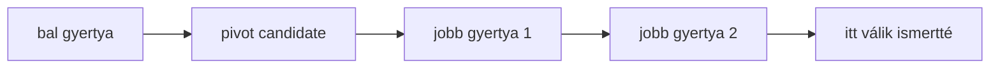
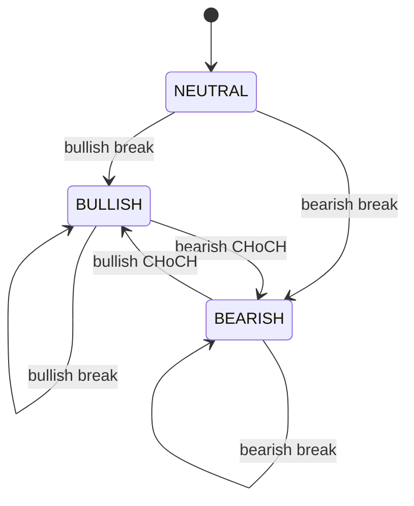

# Market structure

A market structure a swing high és swing low sorozatokból épül. A rendszer csak
megerősített pivotokat használ, így nem úgy kezeli a történelmi adatot, mintha
a pivot már a pivotgyertya pillanatában ismert lett volna.

## Induló paraméterek

- `leftBars`: bal oldali megerősítő gyertyák száma.
- `rightBars`: jobb oldali megerősítő gyertyák száma.
- `breakBuffer`: minimális áttörési buffer.
- `closeConfirmation`: gyertyazárás szükséges-e.

## Confirmed pivot algoritmus

Az első implementáció szigorú lokális extrémumot keres.

Swing high:

```text
candidate.high > minden high a bal oldali ablakban
candidate.high > minden high a jobb oldali ablakban
```

Swing low:

```text
candidate.low < minden low a bal oldali ablakban
candidate.low < minden low a jobb oldali ablakban
```

Ha a szomszédos ablakban azonos high vagy low szerepel, akkor az induló
szigorú modell nem jelöl pivotot. Ez konzervatívabb, de reprodukálhatóbb, mint
az azonos csúcsok önkényes kiválasztása.

## Felismerési idő

Ha `rightBars = 2`, akkor egy `i` indexű pivot legkorábban az `i + 2` indexű
gyertya lezárása után ismert.



Ez azért kritikus, mert a backtest, a TradingView jelölés és a későbbi ML
dataset nem kezelheti úgy a pivotot, mintha már a pivotgyertya pillanatában
ismert lett volna. Ez future leakage lenne.

## BOS algoritmus

Az első BOS implementáció kizárólag confirmed pivotokra épül.

Bullish BOS:

```text
ismert swing high létezik
break gyertya indexe > swingHigh.confirmedAtIndex
breakPrice > swingHigh.price + breakBuffer
```

Bearish BOS:

```text
ismert swing low létezik
break gyertya indexe > swingLow.confirmedAtIndex
breakPrice < swingLow.price - breakBuffer
```

Alapértelmezésben `breakPrice = candle.close`, tehát záróáras megerősítést
használunk. Ha `closeConfirmation = false`, akkor bullish törésnél a high,
bearish törésnél a low alapján is detektálható a szint átszúrása.

Egy pivothoz csak egy BOS esemény készül. Ha az ár több későbbi gyertyán is a
törött szint felett vagy alatt marad, az nem hoz létre újabb eseményt ugyanarra
a pivotra.

Fontos: ez az első implementáció még nem állapít meg teljes trendállapotot. A
következő CHoCH réteg fogja megkülönböztetni, hogy egy struktúratörés a meglévő
irány folytatása vagy karakterváltás-e.

## CHoCH algoritmus

A CHoCH az első implementációban a BOS eseményekből és egy egyszerű
`MarketBias` állapotból származik.

Bias állapotok:

- `NEUTRAL`: még nincs irányított kontextus.
- `BULLISH`: az aktuális struktúra felfelé értelmezett.
- `BEARISH`: az aktuális struktúra lefelé értelmezett.

Bullish CHoCH:

```text
previousBias = BEARISH
structureBreak.kind = BULLISH_BOS
```

Bearish CHoCH:

```text
previousBias = BULLISH
structureBreak.kind = BEARISH_BOS
```

Ha az induló bias `NEUTRAL`, akkor az első BOS csak kontextust ad, de még nem
CHoCH. A CHoCH csak akkor jön létre, amikor már volt értelmezett előző bias, és
az új structure break ezzel ellentétes irányú.



Fontos: a CHoCH önmagában nem garantál trendfordulót. Csak azt jelzi, hogy a
korábbi struktúra irányával ellentétes, jelentős törés történt. A későbbi setup
pontozásnak displacement, FVG, liquidity sweep és risk-reward alapján is
szűrnie kell.

## Kapcsolódó kód

- `apps/api/src/smc_assistant/domain/candles.py`
- `apps/api/src/smc_assistant/domain/market_structure.py`
- `apps/api/tests/test_candles.py`
- `apps/api/tests/test_market_structure.py`
