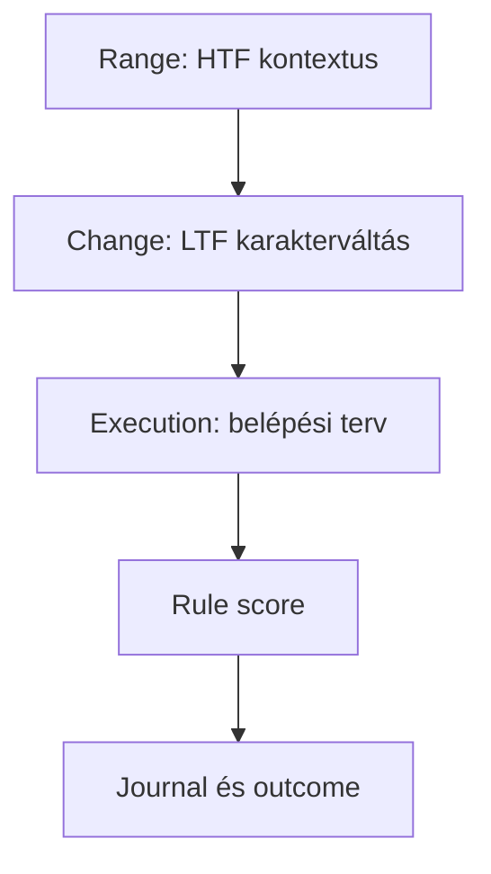

# Stratégiai specifikáció

A projekt egy SMC/ICT-inspired Range-Change-Execution rendszert formalizál.
Ez nem hivatalos vagy teljes Craig Percoco stratégia, hanem tesztelhető,
reprodukálható értelmezés.

## Range

Magasabb idősíkon azonosítjuk:

- swing high és swing low pontokat;
- market structure irányt;
- dealing range-et;
- BOS és CHoCH eseményeket;
- érintetlen FVG-zónákat;
- likviditási célokat;
- premium és discount területeket.

## Change

Alacsonyabb idősíkon keressük:

- liquidity sweepet;
- első karakterváltást;
- CHoCH eseményt;
- erős displacementet;
- új FVG kialakulását.

## Execution

A rendszer belépési tervet készít:

- FVG visszateszt;
- konfigurálható FVG belépési szint;
- invalidációs pont;
- stop loss;
- take profit;
- várható risk-reward;
- setup score;
- elutasítási okok.

